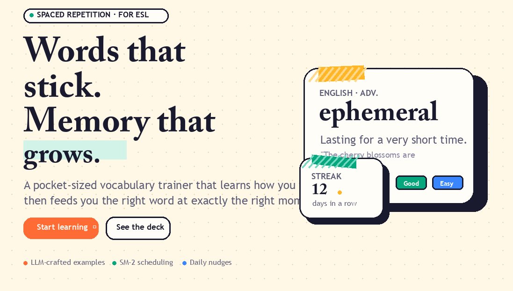
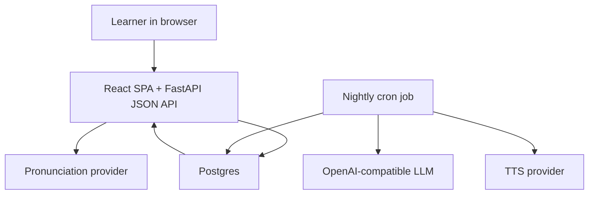

# RecallAI

<p align="center">
  
</p>

<p align="center">
  <strong>Open-source spaced-repetition vocabulary practice with nightly AI-generated lessons.</strong>
</p>

<p align="center">
  <a href="./LICENSE"></a>
  
  
  
</p>

RecallAI is a proof-of-concept vocabulary trainer for ESL learners. It generates fresh, kid-safe English practice, plays reference audio, checks pronunciation, and schedules every word with a battle-tested spaced-repetition algorithm so learners review it right before it fades.

It has shipped as a real production release, but it is also meant to be forked: bring your own database, your own LLM provider, your own keys, your own learner profile, and shape it into your own language-learning product.

## What It Does

| Flow | What RecallAI does | Why it matters |
| --- | --- | --- |
| Generate | Creates new vocabulary and examples with an OpenAI-compatible LLM | Learners get fresh practice instead of a static deck |
| Validate | Parses model output through Pydantic before saving | Bad AI output does not go straight into the product |
| Review | Shows due words in a web platform practice loop | The learner gets a focused daily session |
| Listen | Plays reference word and sentence audio | Pronunciation is part of the learning loop |
| Speak | Records a short clip and returns a pronunciation verdict | Feedback happens inside the review flow |
| Schedule | Updates the next review date with a battle-tested spaced-repetition algorithm | Easy words wait; hard words come back sooner |

## Why This Exists

Most vocabulary tools solve only half the problem.

| Problem | Result |
| --- | --- |
| Static decks get stale | Learners repeat generic words that may not match their interests |
| Manual curation takes work | Learners can set preferences and get more relevant decks automatically |
| AI content is trusted too easily | Awkward or unsafe output can leak into the lesson |
| Practice happens at the wrong time | Words are either over-reviewed or forgotten |
| Audio is treated as decoration | Learners miss the listen-speak-feedback loop |

RecallAI combines AI-generated content with boring reliability boundaries: schema validation, retry limits, idempotent nightly jobs, audio fallbacks, and a spaced-repetition scheduler.

Spaced repetition works because it reviews information near the moment you are about to forget it. RecallAI uses the renowned SM-2 algorithm for that scheduling layer: easy words wait longer, hard words return sooner, and the daily session stays focused.

## Current Status

RecallAI is a production-proven PoC. It is not a polished SaaS template, but the core loop works end to end:

| Area | Status |
| --- | --- |
| React learning app | Working |
| Google OAuth | Working |
| Nightly AI content generation | Working |
| Pronunciation check | Working with configured provider |
| TTS reference audio | Working with configured provider |
| Browser extension | Early stub |
| Multi-language lessons | On the roadmap |

## Quick Start

Requirements:

| Tool | Version |
| --- | --- |
| Python | 3.11 |
| uv | latest stable |
| pnpm | 9+ |
| Docker | latest stable, for local Postgres |

Clone and install:

```bash
git clone https://github.com/ical10/recall-ai.git
cd recall-ai
pnpm install --frozen-lockfile
uv sync --frozen
cp .env.example .env
```

Fill in `.env`:

```bash
LLM_API_KEY=...
LLM_BASE_URL=https://openrouter.ai/api/v1
LLM_MODEL=z-ai/glm-4.5-air
GOOGLE_CLIENT_ID=...
GOOGLE_CLIENT_SECRET=...
GOOGLE_REDIRECT_URI=http://localhost:8000/auth/callback
SECRET_KEY=change-me
```

Reset and seed the local database:

```bash
./scripts/dev_reset.sh
```

Run the app:

```bash
pnpm dev
```

Open `http://localhost:5173`.

Run the nightly generator locally when you want to test real LLM calls:

```bash
cd apps/api
NIGHTLY_FORCE=1 uv run python -m app.jobs.nightly
```

That command spends real provider tokens.

## Bring Your Own Model

RecallAI talks to OpenAI-compatible APIs through the OpenAI Python SDK. Swap providers by changing only these three environment variables:

```bash
LLM_API_KEY=...
LLM_BASE_URL=...
LLM_MODEL=...
```

Known-good examples:

| Provider | Base URL | Model example |
| --- | --- | --- |
| OpenRouter | `https://openrouter.ai/api/v1` | `z-ai/glm-4.5-air` |
| OpenRouter | `https://openrouter.ai/api/v1` | `deepseek/deepseek-v4-flash` |
| OpenCode Go | `https://opencode.ai/zen/go/v1` | `deepseek-v4-flash` |

Other OpenAI-compatible providers should work, but they have not all been smoke-tested.

## Product Principles

| Principle | Meaning |
| --- | --- |
| Validate AI output | Model responses are parsed before they touch Postgres |
| Keep review fast | The web request path does not call the LLM |
| Make audio practical | Starter audio and idempotent rendering keep the first session smooth |
| Let the learner decide | Pronunciation feedback coaches; spaced-repetition ratings stay user-driven |
| Make it forkable | Providers, keys, prompts, and deployment target are yours to change |
| Keep learner data light | Store only the minimal Google profile needed for auth and personalization |
| Do not keep voice clips | Pronunciation recordings are evaluated during the request, not stored |

## Privacy-First Defaults

RecallAI keeps the auth profile small: Google id, email, name, and optional avatar URL. It does not store pronunciation recordings; audio clips are read for the pronunciation check and discarded after the request.

## Architecture



The important product boundary is simple: the web app serves review sessions, while the nightly job does the slow AI work.

The nightly job runs:

```text
shared pool generation -> enrichment -> personalized generation -> missing audio backfill
```

Each generated item passes through the Pydantic schema layer before it becomes a card.

## Tech Stack

The product-critical pieces:

| Area | Choice |
| --- | --- |
| Web app | React 19, TypeScript, Vite |
| API | FastAPI JSON API |
| Data | Postgres, SQLAlchemy 2.0 |
| AI boundary | Pydantic v2 schemas |
| Jobs | Cron-style nightly job |
| Spaced repetition | SM-2 scheduling algorithm |
| Auth | Google OAuth |
| Audio | TTS reference clips + pronunciation evaluation |

## Repository Map

```text
apps/
  api/
    app/
      api/       JSON route handlers
      core/      settings and database setup
      models/    SQLAlchemy users, vocab items, reviews
      schemas/   Pydantic request, response, and LLM contracts
      services/  product logic for generation, audio, scheduling, auth
      jobs/      nightly generation and audio backfill entrypoints
    alembic/     database migrations
    tests/       backend tests
  web/
    src/
      routes/      TanStack Router routes
      components/  review, onboarding, and shared UI
      hooks/       browser audio and interaction hooks
      api/         generated OpenAPI types
      store/       review-session state
  extension/  early browser-extension scaffold
docs/
  adr/        architecture decisions
scripts/      local reset and utility scripts
```

## Development Commands

| Task | Command |
| --- | --- |
| Run app locally | `pnpm dev` |
| Run API tests | `pnpm test` |
| Run web tests | `pnpm test:web` |
| Lint and type-check API | `pnpm lint` |
| Build web app | `pnpm build` |
| Generate frontend API types | `pnpm gen:types` |
| Run nightly job locally | `cd apps/api && NIGHTLY_FORCE=1 uv run python -m app.jobs.nightly` |

## Customize It

Common fork paths:

| Goal | Where to start |
| --- | --- |
| Change the LLM provider | `.env.example`, `apps/api/app/services/llm.py` |
| Tune generated vocabulary | `apps/api/app/services/vocab_generation.py` |
| Change validation rules | `apps/api/app/schemas/llm.py` |
| Customize review behavior | `apps/web/src/components/ReviewPage.tsx` |
| Swap TTS provider | `apps/api/app/services/tts.py` |
| Adjust scheduling | `apps/api/app/services/sm2.py` |

## Roadmap

Near-term ideas, not promises:

- Stronger observability for token spend and nightly job outcomes
- Better parent/teacher progress views
- More language targets beyond English
- FSRS scheduling once enough review data exists
- More complete browser-extension workflow
- Safer corpus review tools for generated content

## Limitations

- The current product is tuned for young ESL learners, not exam prep.
- The generated content is validated, but still needs human review before serious classroom use.
- The operator pays the LLM, TTS, and speech-evaluation bill.
- Provider compatibility is broad in theory, but only a few providers have been tested end to end.
- The browser extension is only a scaffold on `main`.
- Auth stores a minimal Google profile: id, email, name, and optional avatar URL.
- Pronunciation recordings are sent for evaluation during the request and are not stored by RecallAI.

## Contributing

Useful first contributions:

- Improve setup docs
- Add provider smoke-test notes
- Add validation tests for generated content
- Polish the review UI
- Extend the browser-extension scaffold
- Improve observability for LLM and audio costs

Please do not include API keys, OAuth secrets, learner data, audio recordings, or private database dumps in issues or pull requests.

## Disclaimer

RecallAI is a personal open-source project. It is not affiliated with, endorsed by, or sponsored by any LLM provider, deployment platform, education company, or third-party tool mentioned here.

LLM-generated learning content can be wrong, awkward, or culturally off even with validation in place. Treat generated material as draft educational content and review the corpus if you deploy it for real learners.

## License

MIT - see [LICENSE](./LICENSE).
